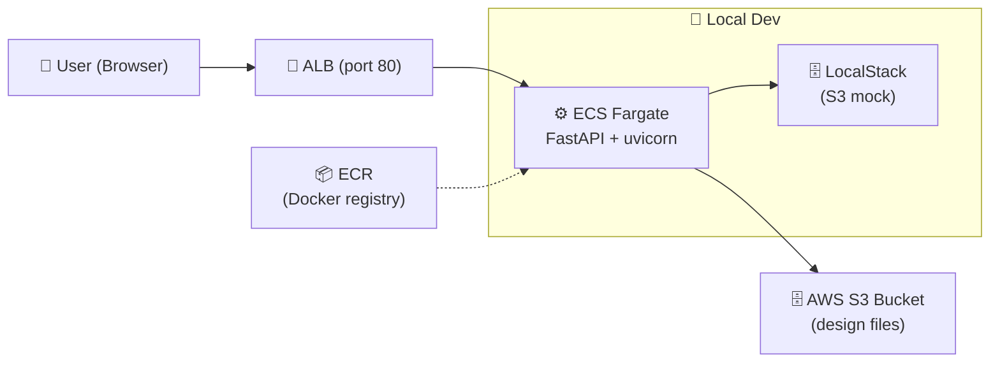

# Design Team File Manager

[](https://www.python.org/)
[](https://fastapi.tiangolo.com/)
[](https://www.terraform.io/)
[](LICENSE)
[](https://github.com/USER/REPO/actions/workflows/ci.yml)
[](https://www.docker.com/)

A FastAPI web application integrated with AWS S3 for a design team to upload, browse, download, and delete images and backup files. Infrastructure provisioned with Terraform and deployed on ECS Fargate.

---

## Architecture



| Environment | Storage | Command |
|-------------|---------|---------|
| **Local dev** | LocalStack (Docker) | `docker compose up` |
| **Production** | AWS S3 (real) | `terraform apply` |

## Stack

- **Backend:** FastAPI + uvicorn
- **Frontend:** Jinja2 + HTMX + Tailwind CSS (CDN)
- **Storage:** AWS S3 (no database)
- **Auth:** Session-based password gate (itsdangerous)
- **Infrastructure:** Terraform → VPC, ALB, ECS Fargate, S3, ECR
- **Testing:** pytest + moto (mocked S3) + httpx

## Screenshots

| Login Page | File List | Upload |
|-----------|-----------|--------|
| *(add screenshot)* | *(add screenshot)* | *(add screenshot)* |

To capture screenshots, run `docker compose up`, open `http://localhost:8000`, and capture the pages.

## Project Structure

```
project1/
├── app/              # Python web application
│   ├── main.py       # FastAPI routes + auth middleware
│   ├── auth.py       # Password gate session tokens
│   ├── s3_client.py  # S3 CRUD operations
│   ├── templates/    # Jinja2 templates (Tailwind + HTMX)
│   ├── static/       # CSS
│   ├── Dockerfile
│   └── requirements.txt
├── infra/            # Terraform configuration (7 files)
│   ├── main.tf, vpc.tf, s3.tf, ecr.tf, ecs.tf
│   ├── variables.tf, outputs.tf
├── tests/            # 24 tests (all passing)
│   ├── test_auth.py, test_s3_client.py, test_routes.py
│   └── conftest.py   # Shared fixtures (moto, etc.)
├── scripts/          # Demo data seeder
│   ├── seed.py
│   └── demo-files/   # Sample SVGs + backup file
├── screenshots/      # Portfolio screenshots
├── Makefile
└── docker-compose.yml  # LocalStack + app
```

## Quick Start (Local Dev)

```bash
# Start LocalStack + App (one command)
docker compose up

# Seed demo files (separate terminal)
cd app && python ../scripts/seed.py

# Open http://localhost:8000
# Password: secret123 (or change in docker-compose.yml)
```

## Running Tests

```bash
cd app
pip install -r requirements.txt
pytest ../tests -v
```

Tests use moto to mock AWS S3 — no real AWS credentials needed. 24 tests currently pass.

## Deployment

```bash
# 1. Build and push Docker image to ECR
AWS_REGION=us-east-1 ECR_REPO=<ecr-repo-url> IMAGE_TAG=latest make up

# 2. Provision infrastructure
cd infra
terraform init
terraform apply -var="app_password=<your-password>"
```

For production, consider storing `APP_PASSWORD` in AWS SSM Parameter Store instead of passing it as a plain variable.

## Design

See [docs/superpowers/specs/2026-05-28-design-file-manager-design.md](docs/superpowers/specs/2026-05-28-design-file-manager-design.md) for the full design specification.
